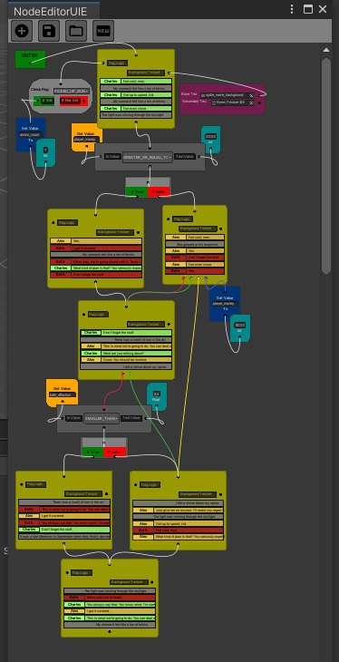

# NodeEditorUIE

A custom node-based graphical editor for Unity. Built for our needs, something very extensible with easy hooking capabilities and the ability to create and integrate your own node types and UI very quickly. Its main feature is the ability to hook up to various custom tools that you may have built, generating a map file which acts as a big container for your custom editor data, with some conditional logic between them to define the sequence of events. Game-side parsing not included in this demo, as the logic is application-specific by nature.

#### Features:
* Node creation from both code and UXML
* Automatic serialization for built-in elements and types
* Reflection system to auto detect custom node types
* Arbitrary node positioning
* Node link visualization
* Zooming and auto-scaling
* Customizable and extensible serialization logic
* Support for generating custom editor data previews
* Save/Load system, including your custom data

## How To Use
### Some basics:
* Start NodeEditorUIE by clicking "Custom Editors" from the top Unity menu bar
* "+" Icon to add a node
* Hold left mouse button to move a node around
* Right click a node for contextual options
* CTRL + Mouse Wheel to zoom in
* DELETE key while dragging link from vert to remove it

Included in Assets/Data/Nodemaps/ is a demo file, which you can open from the editor.

### Hooking up an editor:
This demo features a version of another one of our projects, [DialogEditorUIE](https://github.com/dandy-step/DialogEditorUIE), to demonstrate how to hook up your custom editors to this tool. Create and double click on a DialogNode to open up an instance of the dialog editor and edit your data. NodeEditorUIE will generate a preview of your data the next time it gets focused on. When done editing your data, close the dialog editor, and the node will store your data. If you wish to reload your data, just double click the node again, and a new instance of the editor will open with your previous data, ready for you to continue to edit. See DialogNode.cs and DialogEditorUIE.cs for instructions on how to replicate this feature set for your own tools.

Add a node:

Drag from a vert to another vert to create a sequence:

Double click a node to bring up the editor for that datatype:
